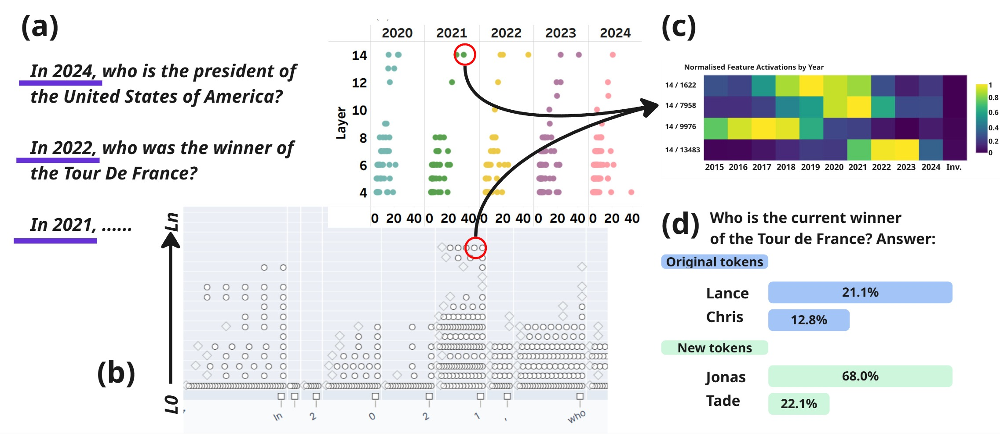

# Time Warp: Identifying Temporal Features within Transcoders for Time Sensitive Factual Recall

## Overview

Large Language Models (LLMs) suffer from temporal misalignment, often due to the contradictory nature of their training corpora. While current mitigation strategies rely on computationally expensive fine-tuning or context-heavy retrieval augmented generation (RAG), the internal mechanisms governing time sensitive recall remain under-explored.

Unlike prior studies that identify temporal components such as attention heads and MLP layers, we provide the **first high-resolution map of temporal recall** by isolating individual MLP features via transcoder circuit tracing. We identify three node categories (**common temporal**, **common to the year** and **chrono-semantic**) which interact to generate a temporal filter during factual recall.



**(a)** Using ChronosAlign to generate question-answer pairs over time. **(b)** Construction of transcoder circuits across time sensitive question-answers, enabling a refined understanding of which layers and transcoder features are selectively important for specific years (common to the year) or temporal recall (common temporal). **(c)** Validation of chrono-semantic nodes against time sensitive subjects (people, places and events), noting average token activation for specific nodes and years. **(d)** Demonstrating the importance of these nodes on time sensitive recall through ablation and steering studies.

### Key Findings

1. **Parallel processing, not strict hierarchy.** Temporal information does not follow a simple linear pipeline but represents time through a parallel and mixed syntactic-semantic interplay across layers. Common to the year and common temporal features are computed simultaneously and integrated compositionally.

2. **Early semantic anchoring.** Contrary to the hypothesis that semantic temporal content emerges only in higher layers, we observe event-anchored features as early as layer 4 (e.g., names of contemporary public figures) and distinct temporal events by layer 7 (e.g., coronavirus pandemic language).

3. **Chrono-semantic nodes.** Higher layer features (e.g., L14F13483, L14F1622, L14F9976 in Gemma-2-2b) act as temporal anchors for specific points in time, with continuous representations spanning 2015–2024.

4. **Ablation removes temporal grounding.** Ablating common temporal features successfully shifts models from explicit to relative/invariant answers, confirming these features are causally necessary for temporal grounding.

5. **Steering enables temporal control.** Year-specific features can be amplified to steer models toward specific temporal contexts, though effect sizes remain smaller than ablation effects.

6. **Two representational methodologies.** Gemma-2-2b uses an additive approach (building temporal representations), while Qwen3-4b uses a subtractive approach (ablating unrequired temporal definitions).

> 📃 [Paper](https://arxiv.org/abs/XXXX.XXXXX)

## Updates

TBA

## Installation

To ensure compatibility with other libraries, we recommend using the following versions. You can adjust based on your environment:

- Python >= 3.10.4
- PyTorch >= 2.4.0
- CUDA 12.2

Then, follow the order of installation.

1. Clone the repository:
```bash
git clone https://github.com/sg-sy/timewarp-temporaltranscoder.git
cd timewarp-temporaltranscoder
```

2. Install dependencies:
```bash
pip install -r requirements.txt
```

3. Clone is other repositories as required:
```bash
git clone https://github.com/EleutherAI/delphi.git
git clone https://github.com/EleutherAI/sparsify.git
``` 

## Datasets

The datasets can be downloaded from PLACEHOLDER
<!-- [here](https://huggingface.co/datasets/sg-sy/timewarp-chronosemantic). -->
Clone the repo and remove the parent folder to replicate the data environment.

### ChronosAlign (Time Sensitive)

A framework and dataset for continuous evaluation of temporal alignment as models evolve. Built from Wikidata and Wikipedia textual and tabular data, containing approximately **26k questions** with up to **500k question-answer pairs** spanning 2010–2025.

Three question types are supported:
- **Invariant**: No temporal condition (e.g., "Who won the MTV Europe Music Award for Best Video?")
- **Relative**: Suggests the most recent (e.g., "Who recently won the MTV Europe Music Award for Best Video?")
- **Explicit**: Provides a specific year (e.g., "In 2024, who won the MTV Europe Music Award for Best Video?")

### Time-Invariant

To assess the impact of temporal feature ablation and steering on non-temporal reasoning, we incorporate [Commonsense](https://arxiv.org/abs/2310.16837) and [GSM8K](https://arxiv.org/abs/2110.14168) datasets.

## Models

Experiments are conducted across three LLMs using per-layer transcoders:

| Model | Replacement Score | Completeness Score |
|-------|:-:|:-:|
| Gemma-2-2b | 0.731 | 0.929 |
| LLaMA-3.2-1b | 0.599 | 0.876 |
| Qwen3-4b | 0.461 | 0.884 |

## Implementation

The implementation is organised into four stages across a series of notebooks. Each stage feeds into the next:

```
1.Benchmarks  →  2.GraphGeneration  →  3.x Conversion Scripts  →  4. Explainer
```

### Stage 1 — Benchmarking (`1.Benchmarks.ipynb`)

Constructs the ChronosAlign benchmark and generates baseline model performance for Gemma-2-2b, LLaMA-3.2-1b, and Qwen3-4b. Produces model answers for invariant, relative, and explicit question types, scores them with F1 and consistency metrics by year, and runs time-invariant benchmarks (GSM8K, Commonsense) used later to validate that temporal interventions do not degrade general reasoning.

### Stage 2 — Transcoder Circuit Construction, Ablation & Steering (`2.GraphGeneration.ipynb`)

The core analytical notebook covering three areas:

- **Circuit Construction & Analysis** — Loads a `ReplacementModel` (base model + per-layer transcoders), runs `circuit_tracer` attribution over ChronosAlign prompts at varying confidence bands, and produces circuit graphs. From these graphs, the three node categories are derived: **common temporal**, **common to the year**, and **chrono-semantic**.
- **Ablation Studies** — Ablates common temporal features to test causal necessity for temporal grounding, with restoration patching and downstream-node analysis.
- **Steering Experiments** — Amplifies year-specific features to steer models toward target temporal contexts. Includes time-invariant validation on GSM8K, Commonsense, and TriviaQA.

### Stage 3 — Transcoder Format Conversion (`3.x`)

Converts transcoders from their native formats into the sparsify format required by the Delphi explainer.

| Notebook | Model | Details |
|----------|-------|---------|
| `3.0 conversion_script.ipynb` | All | Unified conversion script with Gemma, LLaMA, and Qwen sections |
| `3.1.gemma_conversion_script.ipynb` | Gemma-2-2b | gemma-scope npz/safetensors; W_enc transposed; no W_skip |
| `3.2 llama_conversion_script.ipynb` | LLaMA-3.2-1b | mntss safetensors; includes W_skip (`skip_connection: True`) |
| `3.3 qwen_conversion_script.ipynb` | Qwen3-4b | mwhanna safetensors; no W_skip |

Each produces a `sparsify_*_transcoder_*/` directory containing per-layer `sae.safetensors` and `cfg.json` files.

### Stage 4 — Token Activation Testing & Feature Explanation (`4. explainer.ipynb`)

Uses the [Delphi](https://github.com/EleutherAI/delphi) pipeline to explain and score individual transcoder features identified in Stage 2. Caches sparse activations, generates natural-language explanations, and validates chrono-semantic nodes by running custom text activations over temporally contextual people, places, and events (`year_events.csv`). Produces activation heatmaps showing per-feature responses across years 2010–2025.

## Related Forks
PLACEHOLDER
<!-- - [TemporalHead (EAP-IG fork)](https://github.com/sg-sy/TemporalHead) — Upgraded EAP-IG algorithm to accommodate group query attention for Gemma-2-2b, Qwen3-4b and LLaMA3.2-1b.
- [Feature Circuits (fork)](https://github.com/sg-sy/feature-circuits) — Preliminary investigations into the overlap of Feature Circuits with Circuit Tracing using SAEs. -->

## Citation and Acknowledgements

If you find our work useful in your research, please consider citing our paper:
PLACEHOLDER
<!-- ```bibtex
@inproceedings{timewarp2025,
  title={Time Warp: Identifying Temporal Features within Transcoders for Time Sensitive Factual Recall},
  author={Anonymous},
  year={2025}
}
``` -->

We gratefully acknowledge the following open-source repositories and kindly ask that you cite their accompanying papers as well:

```
[1] https://github.com/safety-research/circuit-tracer
[2] https://github.com/dmis-lab/TemporalHead
[3] https://github.com/saprmarks/feature-circuits
[4] https://github.com/EleutherAI/delphi
```

## License

This project is licensed under the MIT License. See the [LICENSE](LICENSE) file for details.
